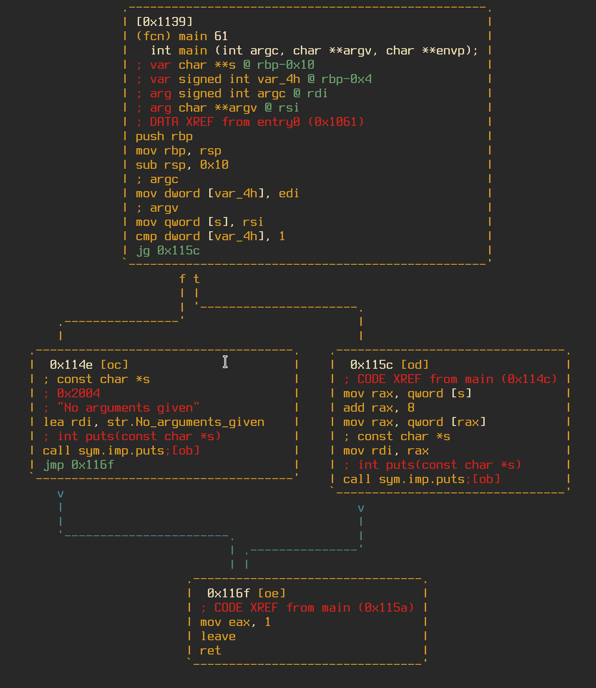
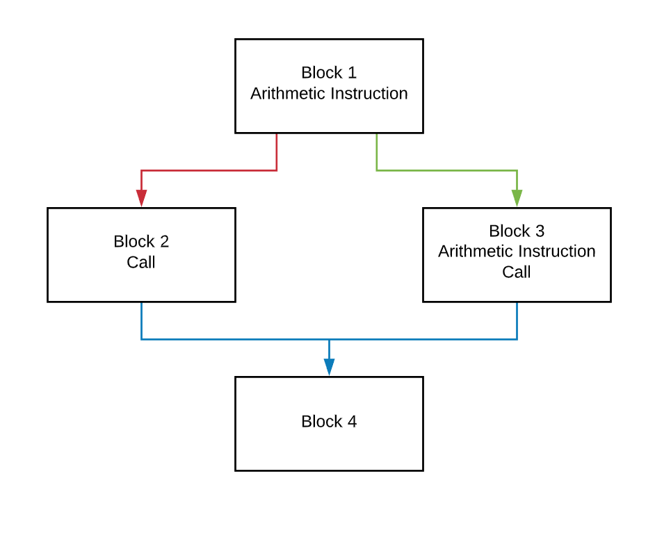

# Machamp

<a href="doc/img/machamp.png"></a>

Based on the fuzzy hashing mechanism <a href="https://github.com/ANSSI-FR/polichombr/blob/dev/docs/MACHOC_HASH.md">Machoc</a>, Machamp is a fuzzy hashing algorithm based on the *Call Flow Graph* _(CFG)_ of a function. With Machamp there is another layer of abstraction, where the hash for a function is based on the individual hash of each basic block. The purpose of this hash is to match functions to easily *"unstrip"* a binary by renaming functions based on their hash.

## Usage

The Machamp application can be used to generate a YAML file of the Machamp hashes for all functions in an application, compare functions in a binary to a pre-existing YAML file that was generate, or to get a single Machamp hash of a function.

#### Generating YAML File

`$ python machamp.py -g [EXCLUDE [EXCLUDE ...]] -o OUTPUT -f sample.exe`</br>
or using `#!pipe`</br>
`> #!pipe python machamp.py -g [EXCLUDE [EXCLUDE ...]] -o OUTPUT`

The `-g` flag takes the optional argument of a list of functions to exclude from hashing. These can be entire function names like `main` or `entry0`, or can be patterns like `fcn.*` to exclude all functions that Radare2 has not named.

The optional `-o` flag specifies where to output the generated YAML file. Without this flag, Machamp will just print the YAML to stdout.

The `-f` flag specifies what binary to analyze. This argument is not needed when working in the Radare2 console.

#### Comparing/Renaming Functions

`$ python machamp.py -r INFILE [EXCLUDE ...] -o OUTPUT -f sample.exe -t 90`</br>
or using `#!pipe`</br>
`> #!pipe python machamp.py -r INFILE [EXCLUDE ...] -o OUTPUT -t 90`

The `-r` flag takes the required argument `INFILE` which specifies which YAML file of Machamp hashes to use for comparison. It also takes a list of functions to `EXCLUDE` from renaming. Just like the `-g` flag these can be entire function names like `main` or `entry0`, or can be patterns like `sym.*` to exclude all system functions that Radare2 has successfully identified.

The optional `-o` flag specifies where to output a YAML file that details which functions matched and how likely they matched.

The `-f` flag specifies which binary to analyze. This argument is not needed when working in the Radare2 console.

The option `-t` flag defines the *threshold* used when function matching. The default value is `80` or 80% matching

#### Getting a Single Machamp Hash

`$ python machamp.py -m FUNC -f sample.exe`</br>
or using `#!pipe`</br>
`> #!pipe python machamp.py -m FUNC`

The `-m` flag takes the required argument `FUNC` whcih specifies which function to generate a hash for.

The `-f` flag specifies which binary to analyze. This argument is not needed when working in the Radare2 console.

## Algorithm

1. Each basic block of a function should be given a number, ordered by address.
2. Each basic block must be translated into a string `NUMBER:j[j];f[f];c[c]`

    * `NUMBER` is the basic block number
    * `j` is the next block's number for when the jump condition is __true__, -1 if not applicable
    * `f` is the next block's number for when the jump condition is __false__, -1 if not applicable
    * `c` is the number of calls made in a block, 0 if none

3. The string is then converted into an md5sum hash and converted to base64
4. The first 6 characters of this hash are taken, this is the hash of that basic block
5. All basic block hashes are combined to form one long hash
6. Another hash is created from the string `[a]:[l]`

    * `a` is the number of arguments the function takes
    * `l` is the number of local variables in the function

7. This hash is then appended onto the end of the hash from step 5, this is the Machamp Hash of the function

## Example

To demonstrate and example of the algorithm, I created a small test program with a main function of 4 basic blocks.

<a href="doc/img/graph.png"></a>

This graph can be simplified into this:

<a href="doc/img/graph_simple.png"></a>

Each block would then be converted into separate strings, along with the function string at the end.
```
1:j3;f2;c0
2:j4;f-1;c1
3:j4;f-1;c1
4:j-1;f-1;c0
2:2
```
Each of these strings would be converted into hashes
```
sgMmuT
bnceyU
5gnnNO
UgsW4t
W1NoZu
```
Which then gets concatenated together, forming the Machamp hash of the function.
`sgMmuTbnceyU5gnnNOUgsW4tW1NoZu`

This hash can then be used as a comparison to other functions for comparison and to see how closely they relate. 
